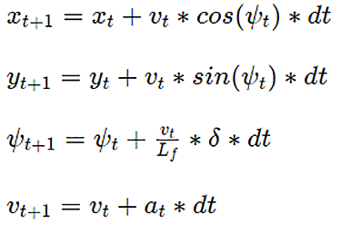

# Udacity Term 2
# Self-Driving Car Engineer Nanodegree
### Model Predictive Control
The goal of this project is to implement a Model Predictive Control (MPC) in C++, in order to drive the car around the track. For that, a simplified Global Kinematic Model is used. After implementation the parameters were tuned to reach a target speed of 100 kph.

The result is recorded in this video:  [Video on Vimeo](https://vimeo.com/267853575)

The project was created with the Udacity [Starter Code](https://github.com/udacity/CarND-MPC-Project) and [Term 2 Simulator](https://github.com/udacity/self-driving-car-sim/releases) Version 1.45. 

---

## Model

The kinematic model that was used for the controller  is simplified by ignoring several parameters like: mass, gravity, tire forces, gravity.
I tried to build a more complex vehicle model. However, for that it is essential to know more parameters such as drag model, throttle-response, tires properties, chassis geometry, etc. These were not provided in this project so that constructing a reasonable dynamic model was not possible-

The following picture shows the vehicle location with Position (_x,y_), heading (_ψ_) and velocity (_v_). So a vehicle state vector can be created: 

**Location: _[x,y,ψ,v]_**


There are two actuators:
1. Steering angle (_δ_). This parameter must be in range [-25,25]°. 
2. Throttle and brake represented as a singular actuator (_a_). Negative values means braking and positive acceleration. The range is [-1,1].

**Actuators: _[δ,a]_**

By taking into account these two vectors (actuators and location) the kinematic model can predict the state for the next time step, as shown in the following equations:



where _Lf_ measures the distance between the front of the vehicle and its center of gravity. This parameter was provided.

Errors:
The heading _ψ_ error (_eψ_) and the cross track error (_cte_) were used to build the MPC cost function. These parameters can be updated to a new time step by using the following equations:


## MPC

The most important tasks was the parameter tuning of the cost function and also adapting other parameters of the MPC for the track.

In the beginning I transformed the waypoints into the vehicle space and fitted a 3rd order polynnom to this data.
In theory there could be problems with latency and stability of the control. Therefore I shifted the actual vehicle state 100ms to the future.
The latency here, simulated the delayed response of the human driver and the complete vehicle chain (actors, sensors, calculation) for self-driving.
So the _cte_ and _eψ_ are calculated and then they passed into the MPC routine.

_T_ is the time horizont. After analyzing the track, I noticed that this could be max. 1,5 s for path planning, because over 1,5 s there are no informations for the desired path. Moreover I used a calculation sparing 3rd order polynom, a further time horizont would require a higher order polynom or a different path planning method.
After a few test drives _T_ = 1,5 s turned out to be a good choice at this speed (100 kph).

THen I have set the time step duration _dt_ = 0.1 s, which is equal to the simulation latency. This requires to set the time steps _N_ to 15, because: _T_ = _dt_ * _N_ 

I tuned the parameters for the cost function by the trial-and-error method in order to reach a smooth and fast (~100 kph) driving e.g. by using the whole track width but avoiding too hard braking before turns


__Note:__ I have tested the controller on a Core i7 2500k and 16GB RAM at a simulation with 1280x960 px and fantastic graphic quality setting. Weak computers could cause latency and other graphic settings could lead to another control behavior.

## Dependencies

Project environment: [Udacity Docker container](https://hub.docker.com/r/udacity/carnd_mpc/). 

* cmake >= 3.5
 * All OSes: [click here for installation instructions](https://cmake.org/install/)
* make >= 4.1
  * Linux: make is installed by default on most Linux distros
  * Mac: [install Xcode command line tools to get make](https://developer.apple.com/xcode/features/)
  * Windows: [Click here for installation instructions](http://gnuwin32.sourceforge.net/packages/make.htm)
* gcc/g++ >= 5.4
  * Linux: gcc / g++ is installed by default on most Linux distros
  * Mac: same deal as make - [install Xcode command line tools]((https://developer.apple.com/xcode/features/)
  * Windows: recommend using [MinGW](http://www.mingw.org/)
* [uWebSockets](https://github.com/uWebSockets/uWebSockets)
  * Run either `install-mac.sh` or `install-ubuntu.sh`.
  * If you install from source, checkout to commit `e94b6e1`, i.e.
    ```
    git clone https://github.com/uWebSockets/uWebSockets 
    cd uWebSockets
    git checkout e94b6e1
    ```
    Some function signatures have changed in v0.14.x. See [this PR](https://github.com/udacity/CarND-MPC-Project/pull/3) for more details.
* Fortran Compiler
  * Mac: `brew install gcc` (might not be required)
  * Linux: `sudo apt-get install gfortran`. Additionall you have also have to install gcc and g++, `sudo apt-get install gcc g++`. Look in [this Dockerfile](https://github.com/udacity/CarND-MPC-Quizzes/blob/master/Dockerfile) for more info.
* [Ipopt](https://projects.coin-or.org/Ipopt)
  * Mac: `brew install ipopt`
  * Linux
    * You will need a version of Ipopt 3.12.1 or higher. The version available through `apt-get` is 3.11.x. If you can get that version to work great but if not there's a script `install_ipopt.sh` that will install Ipopt. You just need to download the source from the Ipopt [releases page](https://www.coin-or.org/download/source/Ipopt/) or the [Github releases](https://github.com/coin-or/Ipopt/releases) page.
    * Then call `install_ipopt.sh` with the source directory as the first argument, ex: `bash install_ipopt.sh Ipopt-3.12.1`. 
  * Windows: TODO. If you can use the Linux subsystem and follow the Linux instructions.
* [CppAD](https://www.coin-or.org/CppAD/)
  * Mac: `brew install cppad`
  * Linux `sudo apt-get install cppad` or equivalent.
  * Windows: TODO. If you can use the Linux subsystem and follow the Linux instructions.
* [Eigen](http://eigen.tuxfamily.org/index.php?title=Main_Page). This is already part of the repo so you shouldn't have to worry about it.
* Simulator. You can download these from the [releases tab](https://github.com/udacity/self-driving-car-sim/releases).
* Not a dependency but read the [DATA.md](./DATA.md) for a description of the data sent back from the simulator.


## Content of this repo

- `src/main.cpp` the main code for the project includes communication with the Simulator and data preprocessing
- `src/MPC.cpp` the MPC implementation
- `src/MPC.h` MPC parameters

## Basic Build Instructions


1. Clone this repo.
2. Make a build directory: `mkdir build && cd build`
3. Compile: `cmake .. && make`
4. Run it: `./mpc`

## Tips

1. It's recommended to test the MPC on basic examples to see if your implementation behaves as desired. One possible example
is the vehicle starting offset of a straight line (reference). If the MPC implementation is correct, after some number of timesteps
(not too many) it should find and track the reference line.
2. The `lake_track_waypoints.csv` file has the waypoints of the lake track. You could use this to fit polynomials and points and see of how well your model tracks curve. NOTE: This file might be not completely in sync with the simulator so your solution should NOT depend on it.
3. For visualization this C++ [matplotlib wrapper](https://github.com/lava/matplotlib-cpp) could be helpful.
